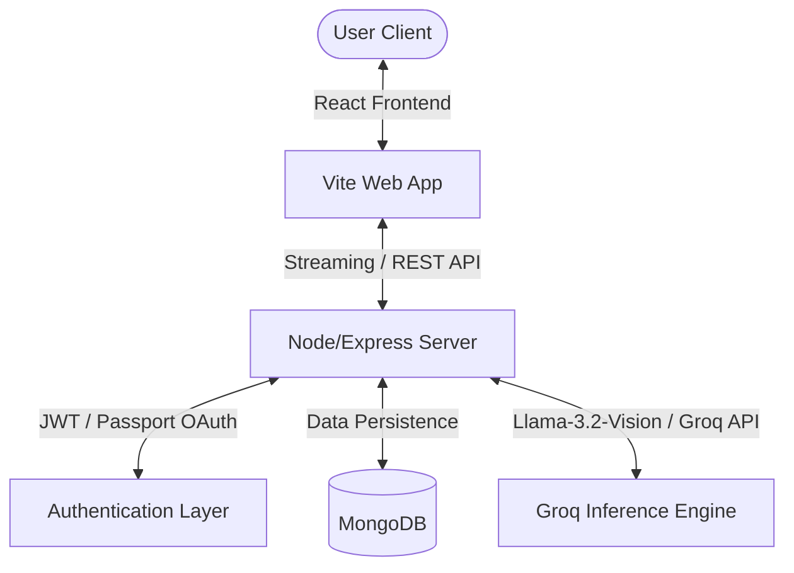

<p align="center">
  
</p>

<h1 align="center">IntelliChat</h1>

<p align="center">
  <strong>Full-Stack AI Conversational Assistant Powered by Groq LLMs</strong>
</p>

<p align="center">
  IntelliChat is a full-stack conversational application built with React, Node.js, and MongoDB, featuring real-time streaming AI responses, user authentication, and context memory normalization.
</p>

<p align="center">
  <a href="https://react.dev/"></a>
  <a href="https://vite.dev/"></a>
  <a href="https://nodejs.org/"></a>
  <a href="https://expressjs.com/"></a>
  <a href="https://www.mongodb.com/"></a>
  <br />
  <a href="https://developer.mozilla.org/en-US/docs/Web/JavaScript"></a>
  <a href="https://jwt.io/"></a>
  <a href="https://groq.com/"></a>
  <a href="https://github.com/features/actions"></a>
  <a href="https://www.docker.com/"></a>
</p>

---

## 📖 Table of Contents

- [About the Project](#-about-the-project)
- [Key Features](#-key-features)
- [Architecture](#-architecture)
- [Folder Structure](#-folder-structure)
- [Installation & Setup](#-installation--setup)
- [Environment Variables](#-environment-variables)
- [API Endpoints](#-api-endpoints)
- [Usage Guide](#-usage-guide)
- [Deployment](#-deployment)
- [Testing](#-testing)
- [Performance & Security](#-performance--security)

---

## 🔍 About the Project

IntelliChat is an advanced conversational interface constructed with React and Node.js. It features a complete environment with full-stack capabilities, resolving the lag of standard HTTP API polling by leveraging Server-Sent Events (SSE). This allows prompt-to-response generation to stream token-by-token instantly. The project includes modular contexts for customizable LLM temperature adjustments, configurable system prompts, user profile identity providers (including Google OAuth), and automatic chat thread pinning/renaming.

---

## ✨ Key Features

| Feature | Description | Core Technology |
| :--- | :--- | :--- |
| **Streaming Responses** | Token-by-token real-time streaming for minimum latency. | Express SSE & Fetch Reader |
| **Markdown & Syntax Highlight** | Renders full markdown and blocks with syntax highlighting. | `react-markdown` & `rehype-highlight` |
| **Context & Memory Manager** | Normalizes and retains historical conversational context. | Groq LLM & Normalizer Helpers |
| **Secure Authentication** | Native Email-Password JWT & OAuth options. | Passport.js & Google Strategy |
| **Thread Management** | Pin, unpin, rename, delete, and clear conversations. | Mongoose Thread Schema |
| **Custom Settings** | Change temperature, system prompts, and vision models. | Client Settings Context |
| **CI/CD Pipeline** | Automates builds, runs tests, and pushes Docker images. | GitHub Actions & GHCR |
| **Full Jest Test Suite** | High Statement, Branch, and Function coverage. | Jest, RTL & jsdom |

---

## 🏗️ Architecture



---

## 📂 Folder Structure

```text
IntelliChat/
├── .github/workflows/       # GitHub Actions CI/CD workflows
├── backend/
│   ├── models/              # Mongoose data schemas (User, Memory, Thread)
│   ├── routes/              # Express API router definitions (Auth, Chat, Memory)
│   ├── utils/               # Utility modules (Groq, Passport, Helpers)
│   ├── tests/               # Backend Jest unit test suites
│   ├── server.js            # Express server entrypoint
│   └── Dockerfile           # Backend container environment
└── frontend/
    ├── src/
    │   ├── __tests__/       # React components testing files
    │   ├── utils/           # Frontend utilities (Navigation helpers)
    │   ├── App.jsx          # Main client interface router
    │   └── main.jsx         # Vite entrypoint
    ├── Dockerfile           # Client container environment
    └── vite.config.js       # Vite build configurations
```

---

## 🚀 Installation & Setup

### Prerequisites
- Node.js (v18+)
- MongoDB Atlas or local MongoDB instance
- Groq API Key

### Step 1: Clone the Repository
```bash
git clone https://github.com/Shivangi1515/IntelliChat.git
cd IntelliChat
```

### Step 2: Configure the Backend Environment
Create a `.env` file in the `backend` directory:
```bash
cd backend
cp .env.example .env
```
Populate the variables:
```env
PORT=8000
MONGO_URI=mongodb://localhost:27017/your_database
JWT_SECRET=your_jwt_secret_key
GROQ_API_KEY=your_groq_api_key
GOOGLE_CLIENT_ID=your_google_client_id
GOOGLE_CLIENT_SECRET=your_google_client_secret
```

### Step 3: Install & Start (Using Docker Compose)
The easiest way to run the full stack is via Docker Compose:
```bash
docker-compose up --build
```
The Frontend will be available at `http://localhost:5173` and the Backend API at `http://localhost:8000`.

### Step 4: Run Locally (Without Docker)
To run without containers, run npm installs and start the dev servers:
```bash
# Start Backend
cd backend
npm install
npm run dev

# Start Frontend
cd ../frontend
npm install
npm run dev
```

---

## ⚙️ Environment Variables

| Variable | Description | Default Value | Required |
| :--- | :--- | :--- | :--- |
| `PORT` | Port the Express server listens on. | `8000` | Yes |
| `MONGO_URI` | Connection URI for the MongoDB instance. | `<your_mongodb_connection_uri>` | Yes |
| `JWT_SECRET` | Secret token used to sign and verify JWT keys. | `<your_jwt_secret_here>` | Yes |
| `GROQ_API_KEY` | Developer API Key from Groq console. | *None* | Yes |
| `GOOGLE_CLIENT_ID` | OAuth Client ID for Google login. | *None* | Optional |
| `GOOGLE_CLIENT_SECRET` | OAuth Client Secret for Google login. | *None* | Optional |

---

## 🔌 API Endpoints

### Authentication
* `POST /api/auth/register` - Create a new account (Guest option fallback).
* `POST /api/auth/login` - Login and get JWT token.
* `GET /api/auth/google` - Initiate Google OAuth login workflow.
* `GET /api/auth/me` - Fetch authenticated user profile details. *(Auth Required)*

### Conversations & Chat
* `GET /api/thread` - Fetch active conversations list. *(Auth Required)*
* `GET /api/thread/:threadId` - Fetch messages in a thread. *(Auth Required)*
* `POST /api/chat` - Send a message and stream AI response. *(Auth Required)*
* `DELETE /api/thread/:threadId` - Delete a specific thread. *(Auth Required)*

### Memory Settings
* `GET /api/memory` - Fetch user Normalizer memories list. *(Auth Required)*
* `POST /api/memory` - Add or update a normalizing record. *(Auth Required)*
* `DELETE /api/memory/:id` - Delete a normalizer record. *(Auth Required)*

---

## 🧪 Testing

Both Frontend and Backend packages contain isolated, database-free unit test suites built using **Jest** and **React Testing Library**.

### Run Backend Tests
```bash
cd backend
npm run test
```

### Run Frontend Tests
```bash
cd frontend
npm run test
```

---

## ⚡ Performance & Security

### Performance
- **Server-Sent Events (SSE)**: Streaming responses minimize the perceived load times (Time to First Token) by pushing tokens directly to the client as they generate.
- **Vite Bundling**: Minimizes asset compilation footprint for maximum rendering efficiency.

### Security
- **JWT Cryptography**: Secure JSON Web Token auth blocks unauthorized API transactions.
- **Environment Isolation**: Critical variables (Groq keys, database URIs) are kept securely hidden in backend scope.
